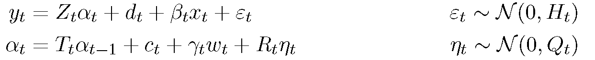

# MFSS - Mixed-Frequency State Space Modeling

Estimation and inference on state space models that allow for mixed-frequency time series data.

For an introduction to mixed-frequency state space modeling see "[A Practitioner's Guide and Matlab Toolbox for Mixed Frequency State Space Models](A Practitioner’s Guide and Matlab Toolbox for Mixed Frequency  State Space Models.pdf)" by Scott Brave, Andrew Butters, and David Kelley.

## Installation

The easiest way to use MFSS is to install it via the toolbox (MFSS.mltbx) by dragging it into the Matlab command window. It should install as an Add-On and be available on your path whenever using Matlab. 

MFSS requires the following Matlab toolboxes: 
- Optimization Toolbox
- Statistics and Machine Learning Toolbox

Further functionality is available through the use of additional toolboxes: 
- Global Optimization Toolbox
- Symbolic Math Toolbox
- Parallel Computing Toolbox

Some examples and tests additionally use the Econometrics Toolbox. 

## Compatibility

MFSS has been tested on Matlab 2017b-2018b. 

It is incompatible with Octave (through at least 4.4.1). 

## Getting Started 

State space models take the form 

For more information on how to put models into this form, see the examples in `/examples`.

### Mixed-frequency data

To handle mixed-frequency data, first set up the model (see below) as if the data were all observed at the highest (base) frequency. Then, create an `Accumulator` to augment the system to make sure it obeys the temporal properties of the data. Two methods of creating an `Accumulator` exist. 

For regularly spaced data (where the number of high-frequency periods in each low-frequency period is fixed for each series), the properties of the timing can be inferred from the data itself. Provide the type (sum or average) and period for each series:

    accum = Accumulator.GenerateRegular(y, {'sum', 'avg', 'avg', ''}, [3 1 3 0]);

For series with irregularly spaced observations (for example, monthly data observed from a weekly model), the calendar and horizon of the accumulator must be specified explicitly: 

	accum = Accumulator(accumulatorIndexes, calendar, horizon); 

With the accumulators defined, we can "augment" a `StateSpace` or `StateSpaceEstimation` to ensure it obeys the timing we observe: 

	ssA = accum.augmentStateSpace(ss);
	ssEA = accum.augmentStateSpaceEstimation(ssE);

For more information on how to specify and use accumulators, see the User Guide. 

### Working with known parameters
With the matrices Z, d, β, H, T, c, γ, R, Q known, we can create a `StateSpace` object: 

    ss = StateSpace(Z, H, T, Q);
    ss = StateSpace(Z, H, T, Q, 'd', d, 'beta', beta, 'c', c, 'gamma', gamma, R', R);

With a `StateSpace` object, we can get the filtered or smoothed estimates of the latent state: 

    a = ss.filter(y);
    a = ss.filter(y, x, w);
    alpha = ss.smooth(y);
    alpha = ss.smooth(y, x, w);

We can also get the decomposition of the smoothed or filtered estimates according to the source of the inference on the state: 

    [yContribution, parameterContribution] = ss.decomposed_smoothed(y);
    [yContribution, parameterContribution, xContribution, wContribution] = ss.decomposed_smoothed(y, x, w);

### Estimating Parameters

To estimate parameters, set elements of the system matrices to `nan` or symbolic variables, then create a `StateSpaceEstimation`: 

    ssE = StateSpaceEstimation(Z, H, T, Q);
    ssE = StateSpaceEstimation(Z, H, T, Q, 'd', d, 'beta', beta, 'c', c, 'gamma', gamma, R', R);

Before estimating, set parameters for estimation including choice of optimization, tolerance, and parallel computing preferences (among others): 

    ssE.solver = 'sa'; % Simulated annealing
    ssE.solveTol = 1e-6;
    ssE.parallel = true;

With the estimation set up, create a `StateSpace` by estimating the unknown parameters: 

    ss = ssE.estimate(y);
    ss = ssE.estimate(y, x, w);

### VAR Estimation

Since vector autoregressions tend to have many more parameters than other models, an expectation-maximization (EM) algorithm is available for estimation. To create a model object, specify the data, the number of lags, and the accumulator, then estimate it on the data: 

    varMdl = MFVAR(y, 2, accum);
    ssEstimated = varMdl.estimate();

## Building the mex files

Substantial performance improvements are possible through using compiled versions of the Kalman filter/smoother functions. 

To build, a mex C/C++ compiler is required. The required library (Armadillo) is included in the mex directory. A complete build of the mex files should be done by running mex/make.m. 

Before running make.m, set up the mex compiler by following the instructions [here](https://www.mathworks.com/help/matlab/matlab_external/choose-c-or-c-compilers.html). 

## Building the Toolbox

To build the toolbox (MFSS.mltbx), run `build/make_toolbox.m`. This process is
sensitive to the paths available when running this file since they will be
included when creating the package. Refer to `make_toolbox.m` for more
instructions on how to build the toolbox.

Using the `make_toolbox.m` script will update the minor version number of the toolbox. It will produce a toolbox file which can be installed in other copies of Matlab by dragging it to the command window. 

When updating the installed version of the toolbox, previous versions should be uninstalled first through the Matlab Add-On Manager to avoid name conflicts. 

## Credits

This library uses [Armadillo](http://arma.sourceforge.net/).

If you use this toolbox in preparing a publication, please cite "A Practitioner's Guide and Matlab Toolbox for Mixed Frequency State Space Models" by Scott Brave, Andrew Butters, and David Kelley. For details on any references in the code, see this publication. 
